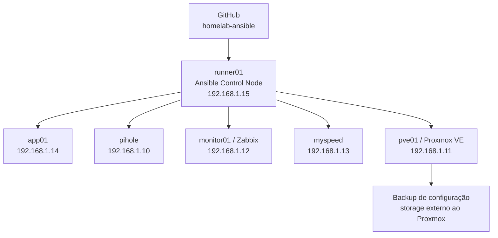

# Gonella HomeLab — Ansible

Repositório de **Configuration Management** do meu HomeLab usando Ansible.

O objetivo do projeto é estudar e aplicar práticas de SysAdmin/DevOps mantendo a configuração do laboratório de forma **reproduzível, idempotente, versionada e auditável**.

> Este repositório foi preparado para visualização pública. Ele contém código e documentação de infraestrutura, mas não deve conter credenciais, backups, bancos de dados, histórico de consultas DNS ou outros dados pessoais de runtime.

## Visão geral



Os endereços mostrados são **RFC1918 privados** e representam a topologia lógica do laboratório. Eles não são endereços públicos acessíveis pela Internet.

O `runner01` é o nó de controle Ansible. Os hosts são acessados via SSH usando uma conta dedicada `ansible`, chave ED25519 e `sudo` para as tarefas privilegiadas.

## Hosts gerenciados

| Host | IP privado | Grupo(s) | Função |
| --- | --- | --- | --- |
| `runner01` | `192.168.1.15` | `managed_linux`, `ansible_control` | Ansible Control Node |
| `app01` | `192.168.1.14` | `managed_linux` | Servidor Linux de laboratório |
| `pihole` | `192.168.1.10` | `managed_linux` | Pi-hole + Unbound / DNS interno |
| `monitor01` | `192.168.1.12` | `managed_linux` | Zabbix Server |
| `myspeed` | `192.168.1.13` | `managed_linux` | Medições de download/upload |
| `pve01` | `192.168.1.11` | `proxmox` | Proxmox VE |

Após convergência, o `site.yml` foi validado com todos esses hosts em `changed=0`, `unreachable=0` e `failed=0`.

## O que este repositório não contém

Por desenho, este projeto **não versiona**:

- histórico/query log do Pi-hole;
- domínios/sites consultados pelos dispositivos da rede;
- bancos de dados do Pi-hole ou Zabbix;
- backups do Proxmox;
- conteúdo da CA interna ou chaves privadas;
- senhas, tokens, webhooks ou credenciais;
- arquivos de ambiente com dados confidenciais;
- o Vault real do ambiente.

A política está detalhada em [`SECURITY.md`](SECURITY.md).

## Estrutura do repositório

```text
homelab-ansible/
├── ansible.cfg
├── SECURITY.md
├── inventory/
│   ├── homelab.yml
│   ├── group_vars/
│   │   ├── all/
│   │   │   └── vault.example.yml
│   │   ├── managed_linux.yml
│   │   └── proxmox.yml
│   └── host_vars/
│       └── monitor01.yml
├── playbooks/
│   ├── bootstrap-ansible.yml
│   └── site.yml
└── roles/
    ├── baseline_linux/
    ├── zabbix_agent2/
    ├── ansible_control_node/
    └── proxmox_host/
```

## Inventário e grupos

O inventário principal fica em:

```text
inventory/homelab.yml
```

### `managed_linux`

Aplica o padrão Linux compartilhado e o Zabbix Agent 2 em:

- `app01`
- `pihole`
- `runner01`
- `monitor01`
- `myspeed`

As variáveis comuns de conexão ficam em `inventory/group_vars/managed_linux.yml`. O caminho da chave SSH é resolvido a partir de `$HOME`, evitando dependência de um nome de usuário pessoal no código.

### `ansible_control`

Contém o `runner01` e aplica configurações exclusivas do nó de controle.

### `proxmox`

Contém o `pve01` e recebe uma role própria. O objetivo é evitar aplicar indiscriminadamente o baseline dos servidores Linux comuns ao hypervisor.

## Playbook principal

O ponto de entrada do ambiente é:

```bash
ansible-playbook playbooks/site.yml
```

Se um Vault local estiver em uso:

```bash
ansible-playbook playbooks/site.yml --ask-vault-pass
```

O `site.yml` aplica:

1. `baseline_linux` + `zabbix_agent2` em `managed_linux`;
2. `ansible_control_node` em `ansible_control`;
3. `proxmox_host` em `proxmox`.

## Roles

### `baseline_linux`

Mantém um baseline simples para servidores Linux:

- atualização controlada do cache APT;
- pacotes administrativos básicos;
- timezone `America/Sao_Paulo`;
- serviço SSH habilitado e ativo.

Entre os pacotes instalados estão `curl`, `wget`, `vim`, `htop`, `jq`, `rsync`, `net-tools`, `dnsutils` e `traceroute`.

### `zabbix_agent2`

Responsável pelo Zabbix Agent 2:

- garante a instalação do `zabbix-agent2`;
- configura `Server`;
- configura `ServerActive`;
- configura `Hostname`;
- mantém o serviço habilitado e ativo;
- reinicia o agent somente quando necessário.

O Zabbix Server do laboratório usa o endereço privado:

```text
192.168.1.12
```

Como o `monitor01` hospeda o próprio Zabbix Server, ele possui um override específico em `inventory/host_vars/monitor01.yml`.

A role também foi ajustada para funcionar corretamente com `--check` em hosts nos quais o arquivo de configuração ainda será criado pela instalação do pacote.

### `ansible_control_node`

Aplicada exclusivamente ao `runner01`.

Garante a presença das ferramentas necessárias ao control node, incluindo:

- Ansible;
- Git;
- OpenSSH Client;
- Python 3 / pip;
- rsync, curl, wget e jq;
- diretório SSH do usuário que executa o Ansible;
- diretório do projeto.

O usuário e o home do control node são resolvidos dinamicamente a partir do ambiente local, tornando a role mais portátil.

### `proxmox_host`

Role específica do `pve01`.

Responsabilidades atuais:

- valida que o host responde ao `pveversion`;
- mantém pacotes administrativos necessários;
- gerencia o Zabbix Agent 2 no hypervisor;
- instala e gerencia o script de backup da configuração do Proxmox;
- instala o service e o timer systemd do backup;
- mantém o timer habilitado e ativo.

A role **não gerencia automaticamente rede, storage ou cluster do Proxmox** neste estágio do projeto.

## Backup da configuração do Proxmox

A role `proxmox_host` gerencia a automação que cria um backup de configuração do `pve01` fora do próprio hypervisor.

Defaults atuais:

```yaml
proxmox_config_backup_hour: "17"
proxmox_config_backup_minute: "00"
proxmox_config_backup_mount: "/mnt/pve/backup-desktop"
proxmox_config_backup_subdir: "host-config"
proxmox_config_backup_keep: 7
```

O script coleta informações como inventário de VMs/LXCs, storage, rede, discos, pacotes e configurações importantes do host antes de gerar o arquivo compactado.

O fluxo foi validado ponta a ponta:

```text
systemd timer
    ↓
pve01-config-backup.service
    ↓
backup-pve01-config.sh
    ↓
storage externo
    ↓
arquivo tar.gz
    ↓
validação de integridade
```

**Os arquivos de backup não fazem parte deste repositório.** Eles podem conter material sensível e permanecem no storage de backup.

## Ansible Vault

O Vault real não é versionado.

O repositório mantém apenas:

```text
inventory/group_vars/all/vault.example.yml
```

Para criar um Vault local:

```bash
cp inventory/group_vars/all/vault.example.yml \
   inventory/group_vars/all/vault.yml

ansible-vault encrypt inventory/group_vars/all/vault.yml
```

O arquivo `vault.yml` está no `.gitignore` e deve permanecer apenas no ambiente local.

## Validações e operação

### Ver o inventário

```bash
ansible-inventory --graph
```

### Testar conectividade

```bash
ansible managed_linux -m ping
ansible pve01 -m ping
```

### Validar sintaxe

```bash
ansible-playbook playbooks/site.yml --syntax-check
```

### Dry-run com diff

Antes de mudanças relevantes:

```bash
ansible-playbook playbooks/site.yml --check --diff
```

Também é possível limitar a execução:

```bash
ansible-playbook playbooks/site.yml \
  --limit monitor01 \
  --check \
  --diff
```

Se o ambiente utiliza Vault, basta adicionar `--ask-vault-pass` aos comandos.

### Aplicar configuração

```bash
ansible-playbook playbooks/site.yml
```

Uma segunda execução deve convergir para `changed=0` quando não houver drift.

## Detecção e correção de drift

O projeto foi testado alterando intencionalmente a permissão de um arquivo gerenciado no `pve01`.

Na execução seguinte, o Ansible detectou a divergência e restaurou o estado definido pela role:

```text
estado desejado no Git
        ↓
      Ansible
        ↓
compara o host real
        ↓
detecta divergência
        ↓
restaura o padrão
```

## Adicionando um novo host Linux

Fluxo utilizado no laboratório:

1. criar a conta dedicada `ansible`;
2. instalar a chave pública do control node;
3. conceder `sudo` para automação;
4. adicionar o host a `inventory/homelab.yml`;
5. testar `ansible <host> -m ping`;
6. executar `site.yml --limit <host> --check --diff`;
7. revisar as alterações;
8. executar o playbook real;
9. executar novamente e confirmar `changed=0`;
10. versionar a mudança.

O `playbooks/bootstrap-ansible.yml` contém a base para criação da conta de automação e instalação da chave SSH.

## Segurança

Práticas adotadas:

- conta `ansible` separada das contas pessoais;
- SSH por chave dedicada para automação;
- `become`/sudo para tarefas privilegiadas;
- segredos locais fora do Git;
- `.gitignore` defensivo para credenciais e dados de runtime;
- roles separadas por responsabilidade;
- dry-run antes de mudanças sensíveis;
- Proxmox isolado em role própria;
- backups fora do hypervisor e fora do repositório.

Consulte [`SECURITY.md`](SECURITY.md) antes de adicionar novos tipos de arquivos ao projeto.

## Pi-hole e privacidade

O `pihole` é gerenciado apenas como um host Linux com Zabbix Agent neste repositório.

**Não são exportados ou versionados** Query Log, histórico de DNS, domínios acessados, banco do Pi-hole ou qualquer registro de navegação dos dispositivos da rede.

## Monitoramento

O Zabbix Server está no `monitor01` (`192.168.1.12`).

Este projeto gerencia o **Zabbix Agent 2** nos hosts. Objetos do Zabbix Server como templates, triggers, dashboards e integrações de alerta ainda não são Configuration-as-Code neste repositório.

O `myspeed` é apenas uma aplicação auxiliar para medições de upload/download da rede.

## Git workflow

Fluxo sugerido:

```bash
git checkout -b feature/minha-alteracao

# editar e validar
ansible-playbook playbooks/site.yml --syntax-check
ansible-playbook playbooks/site.yml --check --diff

git add -A
git diff --cached
git commit -m "Descrição da alteração"
git push -u origin feature/minha-alteracao
```

A mudança pode então ser revisada e integrada à `main` via Pull Request.

## Roadmap

Próximas evoluções:

- `ansible-lint`;
- GitHub Actions para syntax-check/lint em Pull Requests;
- secret scanning automatizado;
- generalizar o bootstrap de novos hosts;
- ampliar o uso de variáveis e templates;
- verificações periódicas de integridade dos backups;
- avaliar Zabbix Configuration-as-Code;
- documentar um procedimento completo de Disaster Recovery do HomeLab.

## Estado atual

A base do projeto já entrega:

- inventário centralizado;
- cinco hosts Linux gerenciados;
- um host Proxmox gerenciado separadamente;
- roles reutilizáveis;
- idempotência validada;
- Zabbix Agent padronizado;
- Ansible Control Node gerenciado pelo próprio Ansible;
- backup automático do Proxmox gerenciado como código;
- estrutura preparada para uso local de Ansible Vault;
- Git workflow com Pull Requests.

---

**Gonella HomeLab** — laboratório pessoal para automação, infraestrutura, observabilidade e práticas de SysAdmin/DevOps.
