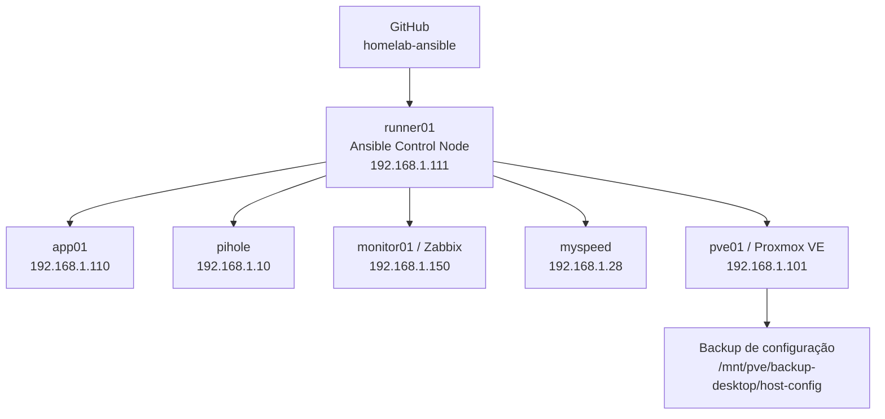

# Gonella HomeLab — Ansible

Repositório de **Configuration Management** do Gonella HomeLab usando Ansible.

O objetivo deste projeto é manter a configuração dos hosts do laboratório de forma **reproduzível, idempotente, versionada e auditável**, reduzindo alterações manuais e permitindo reconstruir o padrão do ambiente a partir do Git.

> O repositório é privado e não deve receber senhas, chaves privadas, tokens, webhooks ou outras credenciais em texto puro.

## Visão geral



O `runner01` é o nó de controle. Os demais hosts são acessados via SSH usando uma conta dedicada `ansible`, chave ED25519 e `sudo` sem senha para a automação.

## Hosts gerenciados

| Host | IP | Grupo(s) | Função |
| --- | --- | --- | --- |
| `runner01` | `192.168.1.111` | `managed_linux`, `ansible_control` | Ansible Control Node |
| `app01` | `192.168.1.110` | `managed_linux` | Servidor Linux de aplicações/laboratório |
| `pihole` | `192.168.1.10` | `managed_linux` | Pi-hole + Unbound / DNS interno |
| `monitor01` | `192.168.1.150` | `managed_linux` | Zabbix Server |
| `myspeed` | `192.168.1.28` | `managed_linux` | MySpeed para medições de download/upload |
| `pve01` | `192.168.1.101` | `proxmox` | Proxmox VE |

Estado atual validado do `site.yml`: todos os hosts acima executam de forma idempotente, com `changed=0`, `unreachable=0` e `failed=0` após convergência.

## Estrutura do repositório

```text
homelab-ansible/
├── ansible.cfg
├── inventory/
│   ├── homelab.yml
│   ├── group_vars/
│   │   ├── all/
│   │   │   └── vault.yml
│   │   ├── managed_linux.yml
│   │   └── proxmox.yml
│   └── host_vars/
│       └── monitor01.yml
├── playbooks/
│   ├── bootstrap-ansible.yml
│   └── site.yml
└── roles/
    ├── baseline_linux/
    ├── zabbix_agent2/
    ├── ansible_control_node/
    └── proxmox_host/
```

## Inventário e grupos

O inventário principal está em `inventory/homelab.yml`.

### `managed_linux`

Aplica o padrão Linux compartilhado e o Zabbix Agent 2 em:

- `app01`
- `pihole`
- `runner01`
- `monitor01`
- `myspeed`

As variáveis comuns de conexão ficam em `inventory/group_vars/managed_linux.yml`.

### `ansible_control`

Contém o `runner01` e aplica configurações exclusivas do nó de controle Ansible.

### `proxmox`

Contém o `pve01` e recebe uma role própria para evitar aplicar indiscriminadamente o baseline dos servidores Linux comuns ao hypervisor.

## Playbook principal

O ponto de entrada do ambiente é:

```bash
ansible-playbook playbooks/site.yml --ask-vault-pass
```

O `site.yml` aplica:

1. `baseline_linux` + `zabbix_agent2` em `managed_linux`;
2. `ansible_control_node` em `ansible_control`;
3. `proxmox_host` em `proxmox`.

## Roles

### `baseline_linux`

Mantém o padrão base dos servidores Linux:

- atualização do cache APT com validade;
- pacotes administrativos básicos (`curl`, `wget`, `vim`, `htop`, `jq`, `rsync`, `net-tools`, `dnsutils`, `traceroute`, entre outros);
- timezone `America/Sao_Paulo`;
- serviço SSH habilitado e ativo.

### `zabbix_agent2`

Responsável pelo Zabbix Agent 2:

- garante que `zabbix-agent2` esteja instalado;
- configura `Server`;
- configura `ServerActive`;
- configura `Hostname`;
- mantém o serviço habilitado e ativo;
- reinicia o agent somente quando a configuração muda.

Por padrão, o Zabbix Server utilizado é:

```text
192.168.1.150
```

O `monitor01`, por hospedar o próprio Zabbix Server, possui override específico em `inventory/host_vars/monitor01.yml`:

```yaml
zabbix_server: "127.0.0.1"
zabbix_server_active: "127.0.0.1"
zabbix_agent_hostname: "Zabbix server"
```

A role também trata corretamente hosts novos em `--check`: antes de editar a configuração, verifica se `/etc/zabbix/zabbix_agent2.conf` já existe.

### `ansible_control_node`

Aplicada exclusivamente ao `runner01`.

Garante a presença das ferramentas necessárias ao control node, incluindo:

- Ansible;
- Git;
- OpenSSH Client;
- Python 3 / pip;
- rsync, curl, wget e jq;
- diretório SSH do usuário `gonella`;
- diretório `/home/gonella/ansible`.

### `proxmox_host`

Role específica do `pve01`.

Responsabilidades atuais:

- valida que o host responde ao `pveversion`;
- mantém pacotes administrativos necessários;
- gerencia o Zabbix Agent 2 no hypervisor;
- instala e gerencia o script de backup da configuração do Proxmox;
- instala o service e o timer systemd do backup;
- mantém o timer habilitado e ativo.

A role **não gerencia automaticamente rede, storage ou cluster do Proxmox**. Esses componentes são mantidos fora da automação por segurança neste estágio do projeto.

## Backup de configuração do Proxmox

A role `proxmox_host` gerencia o backup do estado/configuração do `pve01`.

Defaults atuais:

```yaml
proxmox_config_backup_hour: "17"
proxmox_config_backup_minute: "00"
proxmox_config_backup_mount: "/mnt/pve/backup-desktop"
proxmox_config_backup_subdir: "host-config"
proxmox_config_backup_keep: 7
```

O backup é executado diariamente por um timer systemd e gera arquivos no formato:

```text
pve01-config-YYYY-MM-DD_HH-MM.tar.gz
```

O script valida se o mount de backup está disponível antes de continuar e mantém somente a quantidade de arquivos definida em `proxmox_config_backup_keep`.

O arquivo inclui, entre outros itens:

- `/etc/pve`;
- `/etc/network/interfaces`;
- `/etc/hosts`;
- `/etc/hostname`;
- `/etc/resolv.conf`;
- `/etc/zabbix`;
- `/etc/apt`;
- `/root/homelab-ca`;
- inventário atual de VMs/LXCs, storage, rede, discos e pacotes;
- cópia de `/var/lib/pve-cluster/config.db`.

O fluxo automático já foi validado ponta a ponta:

```text
systemd timer
    ↓
pve01-config-backup.service
    ↓
backup-pve01-config.sh
    ↓
/mnt/pve/backup-desktop/host-config
    ↓
arquivo tar.gz
    ↓
validação de integridade
```

> Atenção: os backups do `pve01` possuem dados sensíveis, incluindo configuração do Proxmox e material da CA interna. O storage de backup deve ser tratado como dado privilegiado.

## Ansible Vault

Segredos destinados ao Ansible devem ser armazenados criptografados com Ansible Vault.

Arquivo atualmente utilizado:

```text
inventory/group_vars/all/vault.yml
```

Para visualizar:

```bash
ansible-vault view inventory/group_vars/all/vault.yml
```

Os comandos do projeto usam `--ask-vault-pass`, evitando armazenar a senha do Vault no repositório.

Nunca versionar:

- senha do Vault;
- chave SSH privada;
- chave privada da CA;
- tokens de API;
- credenciais SMB;
- Discord webhook;
- senhas em texto puro.

## Validações e operação

### Ver o inventário

```bash
ansible-inventory --graph --ask-vault-pass
```

### Testar conectividade

```bash
ansible managed_linux -m ping --ask-vault-pass
ansible pve01 -m ping --ask-vault-pass
```

### Validar sintaxe

```bash
ansible-playbook playbooks/site.yml \
  --syntax-check \
  --ask-vault-pass
```

### Dry-run com diff

Antes de aplicar mudanças relevantes:

```bash
ansible-playbook playbooks/site.yml \
  --check \
  --diff \
  --ask-vault-pass
```

Também é possível limitar a execução a um host:

```bash
ansible-playbook playbooks/site.yml \
  --limit monitor01 \
  --check \
  --diff \
  --ask-vault-pass
```

### Aplicar configuração

```bash
ansible-playbook playbooks/site.yml --ask-vault-pass
```

Uma segunda execução deve convergir para `changed=0` quando não houver drift.

## Detecção e correção de drift

O projeto foi validado alterando intencionalmente a permissão de um arquivo gerenciado no `pve01`.

O Ansible detectou a divergência e restaurou automaticamente o estado definido pela role.

Exemplo do conceito:

```text
estado desejado no Git
        ↓
      Ansible
        ↓
compara o host real
        ↓
detecta divergência
        ↓
restaura o padrão
```

## Adicionando um novo host Linux

Fluxo recomendado:

1. criar a conta dedicada `ansible`;
2. instalar a chave pública do control node;
3. conceder `sudo` via `/etc/sudoers.d/ansible`;
4. adicionar o host a `inventory/homelab.yml`;
5. testar `ansible <host> -m ping`;
6. executar `site.yml --limit <host> --check --diff`;
7. revisar as alterações;
8. executar o playbook real;
9. executar uma segunda vez e confirmar `changed=0`;
10. versionar e enviar a mudança ao GitHub.

O playbook `playbooks/bootstrap-ansible.yml` contém a base para criação da conta de automação e instalação da chave SSH. Ele ainda pode ser generalizado para o onboarding de novos hosts.

## Segurança

Princípios adotados neste projeto:

- repositório GitHub privado;
- acesso SSH por chave dedicada para automação;
- conta `ansible` separada das contas pessoais;
- uso de `become`/sudo para tarefas privilegiadas;
- Ansible Vault para segredos;
- nenhuma chave privada armazenada no Git;
- roles separadas por responsabilidade;
- dry-run antes de mudanças sensíveis;
- Proxmox isolado em role própria;
- backups de configuração fora do host Proxmox.

## Monitoramento

O Zabbix Server está no `monitor01` (`192.168.1.150`).

Este repositório atualmente gerencia **o Zabbix Agent 2 e sua configuração nos hosts**. Objetos do Zabbix Server, como hosts, templates, triggers, dashboards e integrações de alerta, ainda não são tratados como código por este repositório.

O `myspeed` é uma aplicação auxiliar para medir download/upload da rede; não há necessidade atual de criar uma camada complexa de monitoramento específico para ela.

## Git workflow

Fluxo sugerido para mudanças:

```bash
git checkout -b feature/minha-alteracao

# editar e validar
ansible-playbook playbooks/site.yml --syntax-check --ask-vault-pass
ansible-playbook playbooks/site.yml --check --diff --ask-vault-pass

git add -A
git commit -m "Descrição da alteração"
git push -u origin feature/minha-alteracao
```

A mudança pode então ser revisada e integrada à `main` através de Pull Request.

## Roadmap

Próximas evoluções naturais do projeto:

- `ansible-lint`;
- GitHub Actions para syntax-check/lint em Pull Requests;
- generalizar o bootstrap de novos hosts;
- ampliar o uso de variáveis e templates;
- automatizar verificações periódicas de integridade dos backups;
- avaliar Zabbix configuration-as-code para hosts/triggers/templates;
- documentar procedimento completo de Disaster Recovery do HomeLab.

## Estado do projeto

A base atual já entrega:

- inventário centralizado;
- cinco hosts Linux gerenciados;
- um host Proxmox gerenciado separadamente;
- roles reutilizáveis;
- idempotência validada;
- Zabbix Agent padronizado;
- Ansible Control Node gerenciado pelo próprio Ansible;
- backup automático do Proxmox gerenciado como código;
- Ansible Vault;
- versionamento remoto privado no GitHub.

---

**Gonella HomeLab** — laboratório pessoal para automação, infraestrutura, observabilidade e práticas de SysAdmin/DevOps.
